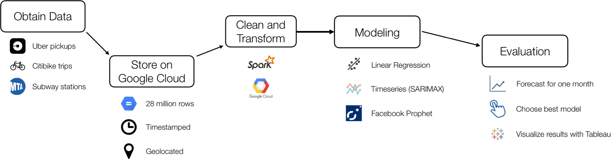

## Forecasting Uber Demand in NYC

This repository contains the notebooks and data used for the analysis in this post: [Forecasting Uber Demand in NYC](https://medium.com/@Vishwacorp/timeseries-forecasting-uber-demand-in-nyc-54dcfcdfd1f9). The output of the modeling can be seen in [this interactive dashboard on Tableau](https://public.tableau.com/profile/ankur.vishwakarma#!/vizhome/UberNYCDashboard/Dashboard1?publish=yes).

The overall process for this project is shown in this flowchart:  

The notebooks and data are separated into their own folders. 
